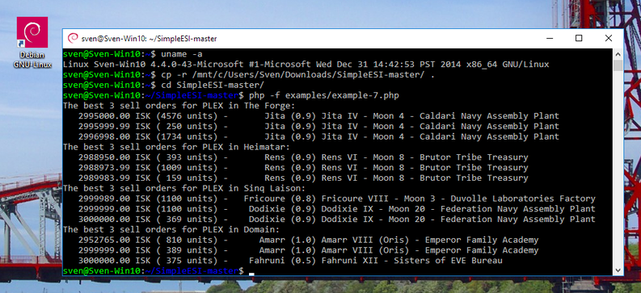
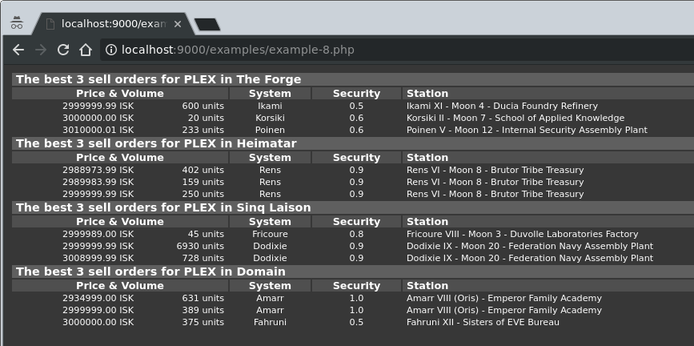
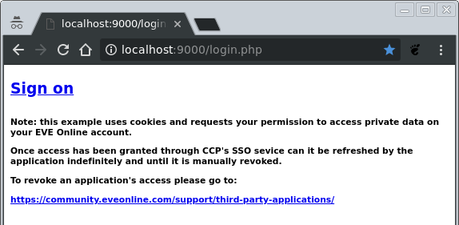
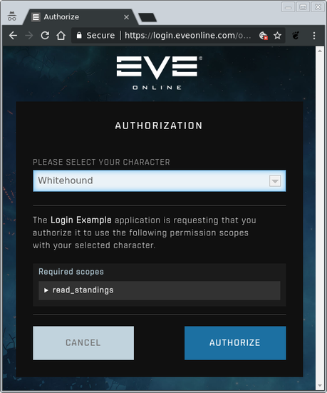

SimpleESI
=========

### *Programming the EVE Swagger Interface (ESI)*

### *The Simple And Easy Way*

### *in PHP*

------------------------------------------------------------------------

Introduction
------------

**What is it?** SimpleESI is an Application Programming Interface (API) for writing third-party applications to the game EVE Online. It builds on the existing interface called the EVE Swagger Interface (ESI), but tries to provide a slim and yet “All In One” alternative to it. In comparison, the default API for PHP consists of 377 files with more than 227,000 lines of machine generated code, whereas SimpleESI consists of one single file with less than 600 lines of code (see also **Features** below).

**For whom is it?** SimpleESI is for everyone, from beginners in web design who don’t want to commit to the full API yet, to the intermediate who is looking to gain an advantage in the game without spending too much time on programming, as well as for the professional who needs a compact API for implementing gadgets.

**Where can I learn more about it?** You will find a list of features as well as several code examples below. A reference manual will be provided at a later time.

To learn more about the game itself and as well its API please follow these links:

<a href="https://www.ccpgames.com/" class="western">CCP Games</a> and <a href="https://www.eveonline.com/" class="western">EVE Online</a>

<a href="https://forums.eveonline.com/" class="western">Game Forum</a> and <a href="https://forums.eveonline.com/c/technology-research/third-party-developers" class="western">Game Forum on 3</a><a href="https://forums.eveonline.com/c/technology-research/third-party-developers" class="western"><sup>rd</sup></a><a href="https://forums.eveonline.com/c/technology-research/third-party-developers" class="western">Party Software Development</a>

<a href="https://developers.eveonline.com/resource/license-agreement" class="western">Developer License Agreement</a> and <a href="https://esi.tech.ccp.is/ui/" class="western">The EVE Swagger Interface</a>

<a href="https://developers.eveonline.com/blog" class="western">3</a><a href="https://developers.eveonline.com/blog" class="western"><sup>rd</sup></a><a href="https://developers.eveonline.com/blog" class="western">Party Developer Blog</a>, <a href="https://developers.eveonline.com/resource/resources" class="western">Resources</a> and <a href="https://developers.eveonline.com/applications" class="western">Managing Applications</a>

<a href="https://developers.eveonline.com/blog/article/swagger-codegen" class="western">The Swagger CodeGen</a> and <a href="https://developers.eveonline.com/blog/article/sso-to-authenticated-calls" class="western">Description of the SSO Procedure</a>

Important notice:

© 2014 CCP hf. All rights reserved. "EVE", "EVE Online", "CCP", and all related logos and images are trademarks or registered trademarks of CCP hf.

© 2018 SimpleESI, GPLv3 applies.

------------------------------------------------------------------------

Features
--------

### *Compact*

- A single file, with one PHP class and five essential methods.

- Less than 600 lines of code.

- Can be used instantly.

### *Fast*

- Support of multiple & single requests over HTTP/1.1 & HTTP/2.

- Request caching, with respect to ESI's expiration timers.

- Support of Just-In-Time processing with callbacks.

- Full page set retrieval, in- and out-of-order.

### *Tolerant*

- Automatic retrial on failed requests.

- Dynamic throttling and exit, with respect to ESI's error limit.

### *Nice*

- Provides an easy "key/value"-database for meta data storage.

- Can use SQLite3 or plain directories & files for storage.

- Logging of errors, traffic flow and performance timings.

- Support of SSO OAuth2 authorization.

- Few configuration options.

------------------------------------------------------------------------

Installation
------------

### General

Apart from fulfilling the platform-specific needs for PHP does one only need to download `SimpleESI.php` and can begin using it. Additionally can one download the examples and the documentation, too. To follow the examples (see below) is it best to <a href="https://github.com/sdack/SimpleESI/archive/master.zip" class="western">download the directory from GitHub as a ZIP file</a> and to extract it.

Note: SimpleESI is free software. Please add a copy of the `LICENSE` file (i.e. as `LICENSE.SimpleESI`) when you include it with your own software so that it can remain free.

### Linux (Debian)

Any recent Linux distribution with PHP7.2, cURL7.58 and SQLite3.22 should work.


The required packages for a Debian-based distribution are called `php`, `php-curl` and `php-sqlite3`:

```
$ sudo apt-get install php php-curl php-sqlite3
```

### Windows (native)

It is currently unknown to me what works. It will however likely need the cURL option `CURLOPT_SSL_VERIFYPEER` set to false, because the native binaries of PHP for Windows do not include any SSL certificates … I will update this part once I know more.

### Windows (Cygwin)

Using Cygwin 2.10 from <a href="http://www.cygwin.com/" class="uri" class="western">http://www.cygwin.com/</a> works and it supports Windows Vista, 7, 8 and 10. To install PHP does one need to select it during the installation process. Cygwin provides a UNIX/Linux-like environment under Windows and supports many popular open source packages.


One will have to use the installer’s search function during the installation to find it. Easiest is to select the entire PHP tree … Once the installation has completed can one run Cygwin and use it like a regular UNIX/Linux shell.

### Windows 10 (WSL with Debian)

Debian under Windows 10 with the Windows Subsystem for Linux (WSL) works, too. However, the Debian distribution first requires an upgrade. Microsoft only provides an older version of Debian (Debian 9 / “Stretch”) and the included packages are already older than what is required. The Windows Subsystem for Linux allows Windows 10 to run native Linux software within Windows.



To install WSL for Windows does one need to follow the steps described by Microsoft <a href="https://docs.microsoft.com/en-us/windows/wsl/install-win10" class="uri" class="western">https://docs.microsoft.com/en-us/windows/wsl/install-win10</a>. After entering a username and a password can one upgrade the distribution to Debian 10 / “Buster” as follows:

```
$ sudo sed -i~ -e 's/stretch/buster/' /etc/apt/sources.list
$ sudo apt-get update
$ sudo apt-get dist-upgrade
$ sudo apt-get autoremove
$ sudo apt-get autoclean
$ sudo apt-get install php php-curl php-sqlite3
```

One will be asked to say “yes” or “no” during the upgrade and one can safely say “yes” to all of the questions. The last line here will install PHP together with cURL and SQLite3 support as shown above for Linux.

------------------------------------------------------------------------

Examples
--------

#### 1. A single request.

```php
<?php
require_once 'SimpleESI.php';

$esi = new SimpleESI;
$esi->get($veldspar, 'universe/types/1230/')->exec();

echo $veldspar['description'].PHP_EOL;
?>
```

```
$ php -f examples/example-1.php
The most common ore type in the known universe, veldspar can be found almost everywhere. It is still in constant demand as it holds a large portion of the much-used tritanium mineral. 

Available in <color='0xFF33FFFF'>1.0</color> security status solar systems or lower.
```

**What it does:** it creates a SimpleESI object to get data on item type 1230 and prints its description.

The `get()`-method of the class SimpleESI is used to queue a request. The `exec()`-method executes queued requests and stores responses in variables that were previously passed to the `get()`-method.

Before sending requests to the server does the `exec()`-method check its cache to see if it has executed the same request recently, and if so, gets it from its cache without sending a request to the server. This is done with respect to the ESI server’s expiration timers so no redundant requests are being send and to speed up program execution. Only when no match is found, or when it has expired, will the `exec()`-method send a request to the server to get a new response. It then also updates its cache.

#### 2. Some more requests.

```php
<?php
require_once 'SimpleESI.php';

$esi = new SimpleESI;
$esi->get($items, [9832, 33468, 12612], 'universe/types/~/')
    ->get($status, 'status/')
    ->exec();

foreach ($items as $id => $thing)
    echo $thing['name'].' has got an id of '.$id.'.'.PHP_EOL;

echo 'There are currently '.$status['players'].
    ' players in EVE Online.'.PHP_EOL;
?>
```

```
$ php -f examples/example-2.php
Coolant has got an id of 9832.
Astero has got an id of 33468.
Void S has got an id of 12612.
There are currently 21356 players in EVE Online.
```

**What it does:** the object is being used to get the game's current status as well as data on 3 item types. The ids for the items are being provided as an array together with a pattern from which it forms the requests. The requests are then executed. Once completed does it print the names and ids of the items, and last but not least, the number of players online.

The `get()`-method allows to queue multiple requests and can create them automatically when given an array and a pattern. The values of the passed array are being inserted at the position of the marker (`~`-sign). The returned data is stored as an array in the variable and the values of the array become the keys to the responses.

The `exec()`-method will first attempt to answer the requests from its cache, but then send out any remaining requests to the ESI server in parallel. This allows the ESI server to respond to multiple requests at once, allowing it to reply in any order it sees fit, which speeds up program execution.

#### 3. What is The Forge's id?

```php
<?php
require_once 'SimpleESI.php';

$esi = new SimpleESI;
$esi->post($bulk, 'universe/ids/', ['The Forge'])->exec();

if (isset($bulk['regions'][0]['id']))
    echo 'The Forge\'s id is '.$bulk['regions'][0]['id'].'.'.PHP_EOL;
?>
```

```
$ php -f examples/example-3.php
The Forge's id is 10000002.
```

**What it does:** the object is used to send a POST request to the ESI server, in order to get the id of The Forge. When found does it print out the id.

The `post()`-method encodes the array (… `[‘The Forge’]`) and sends it directly to the ESI server. POST requests are not cached and are considered slow. They are commonly used to send bulk data to the ESI server as well as for controlling the game client through ESI for instance.

#### 4. Where is The Forge's id?

```php
<?php
require_once 'SimpleESI.php';

$esi = new SimpleESI;
$esi->get($result, 'search/?categories=region&strict=1&', ['search' => 'The Forge'])->exec();

if (isset($result['region'][0]))
    echo 'The Forge\'s id is '.$result['region'][0].'.'.PHP_EOL;
?>
```

```
$ php -f examples/example-4.php
The Forge's id is 10000002.
```

**What it does:** the object is again used to get The Forge's region id, this time by using ESI's search function, and once found printed out.

When an associative array is being passed as argument to the `get()`-method and after the resource path then it creates an URL query string, which is appended to the resource path. This is useful for strings containing characters that need to be encoded, such as `‘The Forge’`. Here it creates:

`'search/?categories=region&strict=1&search=The%20Forge'`

before adding it to the queue and executing it.

#### 5. Which is The Forge’s id?

```php
<?php
require_once 'SimpleESI.php';

$esi = new SimpleESI;

$RegionNameToId = $esi->meta('RegionNameToId');

if (empty($RegionNameToId)) {
    $esi->get($RegionIds, 'universe/regions/')
        ->exec()
        ->get($Regions, $RegionIds, 'universe/regions/~/')
        ->exec();
    $RegionNameToId = array_column($Regions, 'region_id', 'name');
    $esi->meta('RegionNameToId', $RegionNameToId);
}

if (isset($RegionNameToId['The Forge']))
    echo 'The Forge\'s id is '.$RegionNameToId['The Forge'].'.'.PHP_EOL;
?>
```

```
$ php -f examples/example-5.php
The Forge's id is 10000002.
```

**What it does:** it creates a SimpleESI object to see if it holds an array in its meta database for mapping region names to ids. If it cannot find one then it uses the object to create it by first requesting the list of region ids, then requesting the data on all regions based on their ids in a second execution, and then uses the PHP function `array_column()` to map the ids of every region to its name. It then stores the associative array in the meta database so it can find it again next time. Finally, it prints the id of The Forge.

The `meta()`-method functions as a simple “key/value”-database, which is stored alongside with the cache. It allows an application to reduce the number of its ESI requests to an essential minimum. By storing static data such as the names of regions in a local database can one save time and speed up execution. When passed a single argument does the `meta()`-method work as a query. With two arguments does it work as an assignment (“key = value”).

Note: all requests to the ESI server take time. The fastest request is the one, which does not need to be made!

#### 6. All things new and gone.

```php
<?php
require_once 'SimpleESI.php';

$esi = new SimpleESI;

$esi->get($TypeIdsBook, 'universe/types/')
    ->get($TSTypeIdsBook, 'universe/types/?datasource=singularity')
    ->exec();

$old_ids = $new_ids = [];
foreach ($TypeIdsBook as $page)
    foreach ($page as $id)
        $old_ids[] = $id;
foreach ($TSTypeIdsBook as $page)
    foreach ($page as $id)
        $new_ids[] = $id;

echo 'Number of item types found on Tranquility: '.count($old_ids).PHP_EOL;
echo '                              Singularity: '.count($new_ids).PHP_EOL;

$missing_ids = array_diff($old_ids, $new_ids);
echo PHP_EOL.'   Missing on Singularity: '.count($missing_ids).PHP_EOL;
$esi->get($MissingTypes, $missing_ids, 'universe/types/~/')->exec();
if (isset($MissingTypes))
    foreach ($MissingTypes as $type)
        echo '      #'.$id.' - \''.($type['name'] ?? '- unknown -').'\''.PHP_EOL;

$added_ids = array_diff($new_ids, $old_ids);
echo PHP_EOL.'   New on Singularity: '.count($added_ids).PHP_EOL;
$esi->get($AddedTypes, $added_ids, 'universe/types/~/?datasource=singularity')->exec();
if (isset($AddedTypes))
    foreach ($AddedTypes as $id => $type)
        echo '      #'.$id.' - \''.($type['name'] ?? '- unknown -').'\''.PHP_EOL;
?>
```

```
$ php -f examples/example-6.php
Number of item types found on Tranquility: 34029
                              Singularity: 34034

   Missing on Singularity: 0

   New on Singularity: 5
      #47861 - 'Capsuleer Day - Dungeon Spawner'
      #47881 - 'Outpost Conversion Rig 1'
      #47882 - 'Outpost Conversion Rig 2'
      #47883 - 'Outpost Conversion Rig 3'
      #47884 - 'Outpost Conversion Rig 4'
```

**What it does:** the object is used to get the list of all type ids from Tranquility and Singularity. It prints the number of item types found for each server, computes their difference and shows which items can only be found on the test server, and which are missing.

Due to their large size are the lists only available as sets of pages – books. This technique allows the ESI server to respond to every application in a fair manner without one, single application blocking it. It also requires applications to send a request for every page before the data can be processed in its entirety.

The `exec()`-method detects when responses are being segmented into pages and will send additional requests automatically. On completion will a variable hold an array with all pages in their correct order.

#### 7. The price of PLEX.

```php
<?php
require_once 'SimpleESI.php';

$esi = new SimpleESI;

$RegionsOfInterest = [ 10000002 => 'The Forge'  , 10000030 => 'Heimatar',
                       10000032 => 'Sinq Laison', 10000043 => 'Domain' ];
$IdOfPLEX = 44992;

$GLOBALS += $esi->meta('GLOBALS') ?: [];

$esi->get($SellOrders,
          array_keys($RegionsOfInterest),
          'markets/~/orders/?order_type=sell&type_id='.$IdOfPLEX,
          'orders_callback')
    ->exec();
function orders_callback($esi, $rq) {
    global $Stations;
    foreach ($rq->vl as $order)
        if (isset($order['location_id'])) {
            $id = $order['location_id'];
            if (empty($Stations[$id]))
                $esi->get($Stations[$id], 'universe/stations/'.$id.'/', 24*60*60, 'station_callback');
        }
}
function station_callback($esi, $rq) {
    global $Systems;
    if (isset($rq->vl['system_id'])) {
        $id = $rq->vl['system_id'];
        if (empty($Systems[$id]))
            $esi->get($Systems[$id], 'universe/systems/'.$id.'/', 30*60);
    }
}

foreach ($RegionsOfInterest as $id => $name) {
    echo 'The best 3 sell orders for PLEX in '.$name.':'.PHP_EOL;
    $orders = [];
    foreach ($SellOrders[$id] as $page)
        foreach ($page as $order)
            $orders[] = $order;
    usort($orders, function ($a, $b) { return $a['price'] <=> $b['price']; });
    for ($i = 0; $i < 3; ++$i) {
        $o = $orders[$i];
        $station = $Stations[$o['location_id']];
        $system = $Systems[$station['system_id']];
        $security = $system['security_status'];
        printf('   %10.2f ISK (%4d units) - %10s (%.1f) %s'.PHP_EOL,
               $o['price'], $o['volume_remain'], $system['name'], $security, $station['name']);
    }
}

$esi->meta('GLOBALS', [ 'Stations' => $Stations,
                        'Systems'  => $Systems ]);
?>
```

```
$ php -f examples/example-7.php
The best 3 sell orders for PLEX in The Forge:
   2930000.00 ISK (1266 units) -       Jita (0.9) Jita IV - Moon 4 - Caldari Navy Assembly Plant
   2995999.99 ISK ( 500 units) -       Jita (0.9) Jita IV - Moon 4 - Caldari Navy Assembly Plant
   2996000.00 ISK ( 792 units) -       Jita (0.9) Jita IV - Moon 4 - Caldari Navy Assembly Plant
The best 3 sell orders for PLEX in Heimatar:
   2899999.90 ISK ( 174 units) -       Rens (0.9) Rens VI - Moon 8 - Brutor Tribe Treasury
   2900000.00 ISK ( 469 units) -       Rens (0.9) Rens VI - Moon 8 - Brutor Tribe Treasury
   2988973.99 ISK (1029 units) -       Rens (0.9) Rens VI - Moon 8 - Brutor Tribe Treasury
The best 3 sell orders for PLEX in Sinq Laison:
   3006599.91 ISK ( 128 units) -    Dodixie (0.9) Dodixie IX - Moon 20 - Federation Navy Assembly Plant
   3006599.92 ISK ( 310 units) -    Dodixie (0.9) Dodixie IX - Moon 20 - Federation Navy Assembly Plant
   3006990.00 ISK (1990 units) -    Dodixie (0.9) Dodixie IX - Moon 20 - Federation Navy Assembly Plant
The best 3 sell orders for PLEX in Domain:
   3000000.00 ISK ( 375 units) -    Fahruni (0.5) Fahruni XII - Sisters of EVE Bureau
   3000000.00 ISK ( 377 units) -      Amarr (1.0) Amarr VIII (Oris) - Emperor Family Academy
   3050000.00 ISK (1000 units) -      Amarr (1.0) Amarr VIII (Oris) - Emperor Family Academy
```

**What it does:** the SimpleESI object is used to set two global variables with the help of the `meta()`-method. It is then used to queue 4 requests for sell orders on PLEX, one for each region of interest, and to execute the requests. The last argument passed to the `get()`-method is the name of a function, which will be called at the moment a response arrives and once for each of the four requests. The callback function `orders_callback()` will then itself queue additional requests and for every station listed in the sell orders, if the station is not already known. These secondary requests themselves have a second callback function `station_callback()` registered with them. The secondary callback is used to queue even more requests, one for each system it does not yet know about. Once all requests have been executed does it print out the 3 best PLEX sell orders for each region of interest. At the end is the object used again to store system and station information so it can be retrieved again later.

Requests queued with the `get()`-method from within callbacks do not require an explicit call to the `exec()`-method, because the requests are being queued while an execution is already running. The calls to the `get()`-method inside the callback functions further each get passed a numeric argument. This number is used to briefly extend the expiration time of a request artificially. The reason why this can be useful is because some resources of the ESI have unusual expiration times, or simply fall onto the downtime. So does the information on stations expire within only 5 minutes. Yet the stations themselves do not seem to change at all... It is because of the office rent prices contained within the information that their data expires so quickly. Yet for this application are the rent prices of no interest and therefore it makes sense to ignore the short expiration timers and to extend these artificially by +24 hours. The information on solar systems expires every 24 hours during downtime where the ESI server is unavailable. Extending the expiration timers for such resources artificially by +30 minutes can help in avoiding the downtime.

Callbacks allow to react to responses the moment these arrive, and before all requests have been answered and before execution ends. This speeds up applications by exploiting the ESI server’s ability to respond to requests out of order.

Note: due to the current structure of the ESI does this example only list prices found at NPC stations and does not include sell orders at player-owned stations.

#### 8. Onto the Web!

```php
<!DOCTYPE html><html lang="en"> <meta http-equiv="refresh" content="300"><head><style>
body      { color: #ffffff; background-color: #373737; }
table     { width: 100%; }
tr.region { font-size: 90%; margin: 0px; text-align:   left; background-color: #5f5f5f; }
tr.head   { font-size: 80%; margin: 0px; text-align: center; background-color: #4f4f4f; }
tr.data   { font-size: 70%; margin: 0px; text-align:  right; }
td, th    { padding-left: 5px; padding-right: 5px; padding-top: 0px; padding-bottom: 0px; }
</style></head><body><table>
<?php
require_once '../SimpleESI.php';

$esi = new SimpleESI;

if (isset($_GET['debug'])) {
    $esi->debug_level = 4;
    $esi->debug_html = true;
}

$RegionsOfInterest = [ 10000002 => 'The Forge'  , 10000030 => 'Heimatar',
                       10000032 => 'Sinq Laison', 10000043 => 'Domain' ];
$IdOfPLEX = 44992;

$GLOBALS += $esi->meta('GLOBALS') ?: [];

$esi->get($SellOrders,
          array_keys($RegionsOfInterest),
          'markets/~/orders/?order_type=sell&type_id='.$IdOfPLEX,
          'orders_callback')
    ->exec();
function orders_callback($esi, $rq) {
    global $Stations;
    foreach ($rq->vl as $order)
        if (isset($order['location_id'])) {
            $id = $order['location_id'];
            if (empty($Stations[$id]))
                $esi->get($Stations[$id], 'universe/stations/'.$id.'/', 24*60*60, 'station_callback');
        }
}
function station_callback($esi, $rq) {
    global $Systems;
    if (isset($rq->vl['system_id'])) {
        $id = $rq->vl['system_id'];
        if (empty($Systems[$id]))
            $esi->get($Systems[$id], 'universe/systems/'.$id.'/', 30*60);
    }
}

foreach ($RegionsOfInterest as $id => $name) {
    echo '<tr class="region"><th colspan="10">The best 3 sell orders for PLEX in '.$name.'</th></tr>';
    $orders = [];
    foreach ($SellOrders[$id] as $page)
        foreach ($page as $order)
            $orders[] = $order;
    usort($orders, function ($a, $b) { return $a['price'] <=> $b['price']; });
    echo '<tr class="head">'
        .     '<th colspan="2">Price & Volume</th><th>System</th><th>Security</th>'
        .     '<th style="text-align:left">Station</th></h5></tr>';
    for ($i = 0; $i < 3; ++$i) {
        $o = $orders[$i];
        $station = $Stations[$o['location_id']];
        $system = $Systems[$station['system_id']];
        $security = $system['security_status'];
        printf('<tr class="data">'
               .  '<td>%10.2f ISK</td><td>%4d units</td><td style="text-align:center">%s</td>'
               .  '<td style="text-align:center">%.1f</td><td style="text-align:left">%s</td></tr>',
               $o['price'], $o['volume_remain'], $system['name'], $security, $station['name']);
    }
}

$esi->meta('GLOBALS', [ 'Stations' => $Stations,
                        'Systems'  => $Systems ]);
?></table></body></html>
```

```
$ php -S localhost:9000
PHP 7.2.4 Development Server started at Fri Apr 13 21:39:02 2018
Listening on http://localhost:9000
Document root is /home/sven/EVE/SimpleESI
Press Ctrl-C to quit.
[Fri Apr 13 21:39:08 2018] 127.0.0.1:56846 [200]: /examples/example-8.php
```

**What it does:** it is the same example as before, now embedded within HTML and extended `echo`- & `printf`-statements to include HTML tagging. It further checks if it’s URL contains a query argument with the name `debug`, in which case it enables debug support for the SimpleESI object.

When php is run with `-S localhost:9000` does it start a small web server on the local machine at port 9000 and the URL <a href="http://localhost:9000/examples/example-8.php" class="uri" class="western">http://localhost:9000/examples/example-8.php</a> will open the example and display its output in a browser.



When opened with <a href="http://localhost:9000/examples/example-8.php?debug=1" class="uri" class="western">http://localhost:9000/examples/example-8.php?debug=1</a> does it include debugging information on the SimpleESI object. It shows the time and number of bytes received since creation, the debug level and a message for each event.


#### 9. Halt, who goes there?

```php
<?php
require_once '../SimpleESI.php';

if (isset($_GET['code'])) {
    $code = $_GET['code'];
    setcookie('code', $code);
} elseif (isset($_GET['signout']))
    setcookie('code', '', 0);
elseif (isset($_COOKIE['code']))
    $code = $_COOKIE['code'];

echo <<<'EOT'
<!DOCTYPE html><html lang="en"><head><style>
table { background-color: #efefef; }
td    { font-size: 70%; padding-left: 5px; padding-right: 10px; padding-top: 0px; padding-bottom: 0px; }
</style></head><body>
EOT;

$esi = new SimpleESI('confidential');

$Authorization = $esi->meta('LastAuthorization');
if (empty($code) || empty($Authorization['code']) || $code !== $Authorization['code'])
    $Authorization = [ 'client_id'     => '...',
                       'client_secret' => '...',
                       'redirect_uri'  => 'http://localhost:9000/login.php',
                       'scopes'        => [ 'esi-characters.read_standings.v1' ] ];

if ($esi->auth($Authorization, $code) === false) {
    echo '<h3><p><a href="'.$Authorization['auth_uri'].'">Sign on</a></p></h3>';
    echo '<h6><p>Note: this example uses cookies and requests your permission to access private data on your'
        .' EVE Online account.</p><p>Once access has been granted through CCP\'s SSO sevice can it be refreshed by the'
        .' application indefinitely and until it is manually revoked.</p><p>To revoke an application\'s access'
        .' please go to:</p>'
        .'<p><a href="https://community.eveonline.com/support/third-party-applications/">'
        .'https://community.eveonline.com/support/third-party-applications/</a></p></h6></body>';
    exit;
}

$esi->meta('LastAuthorization', $Authorization);
echo '<h3><p><a href="'.$Authorization['redirect_uri'].'?signout=true">Sign out</a></p></h3>';

$t = $Authorization['expires'] - time();
printf('<p>Current token expires in %2d:%02d minutes.</p>'.PHP_EOL, $t / 60, $t % 60);

$esi->get($Standings, 'characters/'.$Authorization['char_id'].'/standings/', 0, $Authorization)
    ->get($Factions, 'universe/factions/')
    ->exec();
$FactionIdToName = array_column($Factions, 'name', 'faction_id');
$FactionStandings = [];
foreach ($Standings as $st)
    if ($st['from_type'] === 'faction')
        $FactionStandings[$FactionIdToName[$st['from_id']]] = $st['standing'];
arsort($FactionStandings, SORT_NUMERIC);

echo '<p>Faction standings of '.$Authorization['char_name'].':</p><table>';
foreach ($FactionStandings as $name => $standing)
    printf('<tr><td>%s</td><td style="text-align:right">%.2f</td></tr>', $name, $standing);
echo '</table></body>';
?>
```

```
$ cd examples/
$ php -S localhost:9000
PHP 7.2.4 Development Server started at Fri Apr 20 14:43:11 2018
Listening on http://localhost:9000
Document root is /home/sven/EVE/SimpleESI/examples
Press Ctrl-C to quit.
[Fri Apr 20 14:43:23 2018] 127.0.0.1:39826 [200]: /login.php
```

**What it does:** it determines if an authorization was previously given, and if so tries to refresh it. If not does it prompt with a link to obtain a new authorization. On success does it print the faction standings of the character whose authorization was given as well as the duration of the current authorization period.

For the example to work does one need to register it as an application at <a href="https://developers.eveonline.com/applications/create" class="uri" class="western">https://developers.eveonline.com/applications/create</a> with a redirection URI of `http://localhost:9000/login.php` and a scope of `esi-characters.read_standings.v1`, which is used for reading a character’s standings. Further does one need to insert the client ID and the client secret given out by CCP on registration as strings into the script (see where it has the `‘...’` strings).

When the script is run for the first time does it not know of a previous authorization nor of any code and so the call to the `auth()`-method will fail, leading the script to prompt the user with a link. The link itself contains information about the request and will lead the user to CCP’s Single Sign-On service. The information contained in this link is provided by the `auth()`-method by inserting it into the array that was passed as argument.



On following the link is the user prompted to login at CCP’s web site, to give authorization to the application and to choose for which character it shall be.



On clicking the “Authorize” button will CCP’s web site redirect back to `http://localhost:9000/login.php` and provide a unique code to the script, which is passed on to the `auth()`-method and used to receive tokens from CCP that are needed in making authorized requests to the ESI server.


Although the initial code is usable only once is it being given a secondary use by the script, which is that of a “session identifier”. The script stores the code inside the browser with a cookie, as well as on the server in its meta database, together with further information about the authorization. Each time the user accesses the script with a cookie does it compare the code stored inside the cookie with the code stored inside its database to determine if it still in session with the same user, in which case it will refresh the authorization with the help of the `auth()`-method and without sending the user back to the SSO service.

Clicking on the “Sign Out” link will call the script with an argument of `signout=true`, causing it to clear the cookie from the browser and so ending the session.

Note: the example only demonstrates how one can use the `auth()`-method to create a single-user application. The `auth()`-method simply acquires the data needed to make authorized requests and helps in creating and refreshing an authorization. It does not provide the means for managing multiple users simultaneously, as this would go beyond the intended scope of the method. Instead, when a full user management is needed then it has to be implemented by the application itself and it is also the responsibility of the application to keep sensitive data safe for all users.

However, the `auth()`-method does store the character id inside the array among other data, which subsequently is being used by SimpleESI to keep cached responses separate for different users. This happens transparently whenever authorized requests are queued and executed with the get()- and `exec()`-method.


